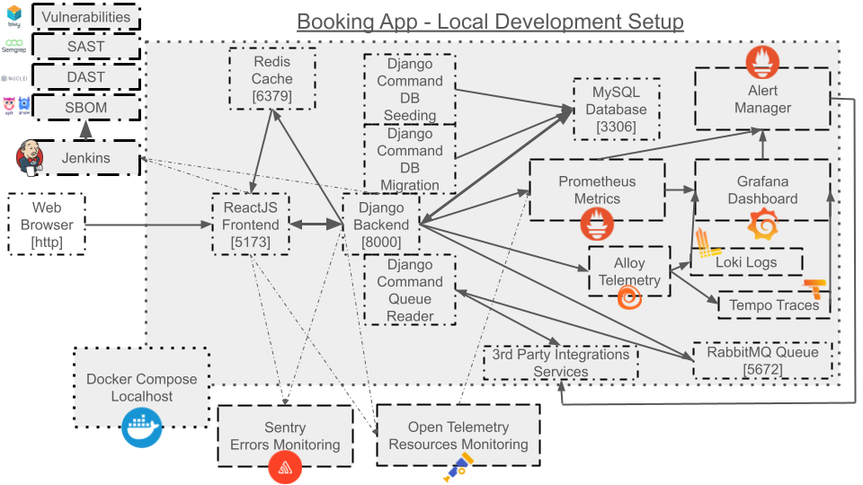

# Basic Hotel Booking App

## Diagram



---

## CI/CD

> GitLab: [.gitlab-ci.yml](.gitlab-ci.yml)

---

## GitOps

> Argo-CD Application Spec: [argo-cd-application-spec.yaml](.argo-cd/argo-cd-application-spec.yaml)

---

## DevSecOps

> Jenkins Container: [compose.yaml](compose.yaml) / [jenkins.Dockerfile](jenkins.Dockerfile)

> Jenkins Pipeline with Vulnerability Scanner, SBOM and SAST: [Jenkinsfile](Jenkinsfile)

> Docker Local Vulnerability Scanner, SBOM and SAST Container: [compose.yaml](compose.yaml) / [vulnerabilities.Dockerfile](vulnerabilities.Dockerfile)

> DAST Scanner Container and Config: [compose.yaml](compose.yaml)

- Vulnerability Scanner: [Trivy](https://github.com/aquasecurity/trivy)

- SBOM: [Syft](https://github.com/anchore/syft) / [Grype](https://github.com/anchore/grype)

- SAST: [Semgrep](https://github.com/semgrep/semgrep)

- DAST & Pen-Testing: [Nuclei](https://github.com/projectdiscovery/nuclei)

---

## SRE Monitoring

### Metrics

> Prometheus Config: [.prometheus/config/prometheus.yml](.prometheus/config/prometheus.yml)

> Prometheus Rules: [.prometheus/rules/prometheus.rules](.prometheus/rules/prometheus.rules)

> Prometheus Container: [compose.yaml](compose.yaml)

### Logging

> Loki Config (via Alloy): [.loki/config/loki-config.yaml](.loki/config/loki-config.yaml)

> Loki Container: [compose.yaml](compose.yaml)

### Tracing

> Tempo Config (via Alloy): [.tempo/config/tempo.yaml](.tempo/config/tempo.yaml)

> Tempo Container: [compose.yaml](compose.yaml)

### Resources and Networking

> OpenTelemetry Config: [opentelemetry-python](https://opentelemetry-python.readthedocs.io/en/latest/examples/django/README.html)

### Visualization

> Grafana Dashboard Metrics: [.grafana/dashboards/django-metrics-dashboard.json](.grafana/dashboards/django-metrics-dashboard.json)

> Grafana Prometheus Datasource: [.grafana/datasources/prometheus-datasource.yaml](.grafana/datasources/prometheus-datasource.yaml)

> Grafana Loki Datasource: [.grafana/datasources/loki-datasource.yaml](.grafana/datasources/loki-datasource.yaml)

> Grafana Tempo Datasource: [.grafana/datasources/tempo-datasource.yaml](.grafana/datasources/tempo-datasource.yaml)

> Grafana Alerts: [.grafana/alerting/sample-django-alert.yaml](.grafana/alerting/sample-django-alert.yaml) / [.grafana/alerting/sample-django-alert-resource.yaml](.grafana/alerting/sample-django-alert-resource.yaml)

> Grafana Container: [compose.yaml](compose.yaml)

### Alerting

> Alertmanager Config: [.alertmanager/config/alertmanager.yml](.alertmanager/config/alertmanager.yml)

> Alertmanager Container: [compose.yaml](compose.yaml)

### Unified Telemetry Collector

> Alloy Config (for Loki / Tempo): [.alloy/config/config.alloy](.alloy/config/config.alloy)

> Alloy Container: [compose.yaml](compose.yaml)

---

## Backend Setup

> Note: Python 3.12 recommended

- create `.env` file
```bash
SECRET_KEY='some-string'
SENTRY_DNS_DJANGO='https://...ingest.us.sentry.io/...'
ALERT_MANAGER_SLACK_API_URL="https://hooks.slack.com/services/..."
ALERT_MANAGER_SLACK_API_CHANNEL="#..."
```

> Note: see https://sentry.io/pricing/ for a Sentry free-trial account to gain access to the monitor dashboard

- setup application
```bash
python3.12 -m venv ./.venv
source ./.venv/bin/activate
python3 -m pip install -r requirements.txt
python3 manage.py makemigrations
python3 manage.py migrate
```

- Populate database
```bash
python3 manage.py create_units
```

---

## Backend Execution

1. In terminal (Without React Frontend, Redis, RabbitMq, Prometheus and Grafana stack):
```bash
python3 manage.py runserver
```

2. Orchestration with Docker Compose (With React Frontend, Redis, RabbitMq, Prometheus and Grafana stack):
```bash
docker compose up --build --no-deps --force-recreate --remove-orphans
```

> Note: Running in orchestration will require either commenting out to disable or [cloning the react frontend](https://gitlab.com/LarryGeorges-Muala/hotel-booking-frontend-reactjs) code in the `compose.yaml` file to enable it

3. In a separate terminal, run the following to start the RabbitMq queue reader and consume messages:
```bash
python3 manage.py rabbitmq_read_queue --host localhost --queue booking
```
